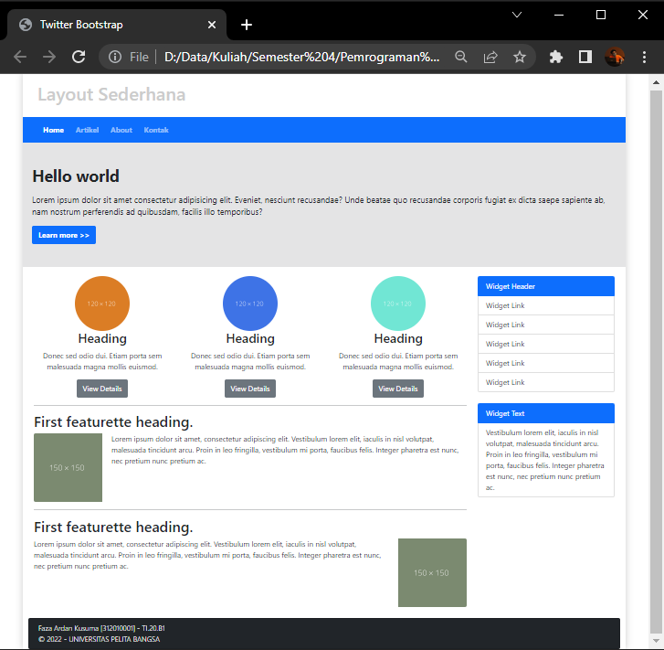

# Lab6Web

## Tugas Praktikum 6

Nama    : Faza Ardan Kusuma <br>
NIM     : 312010001<br>
Kelas   : TI 20 B1

<hr>

## Web Framework
Pada tugas ke enam ini saya mendapat tugas untuk membuat Web Framework twitter bootstrap dengan tampilannya kurang lebih seperti berikut :<br>
<br>

Pertama saya buat folder <b>Lab6Web</b> yang berisikan readme & folder Pic yang isinya nanti gambar langkah - langkah pembuatan web. Saya buat folder lagi, yaitu <b>lab6_css_framework</b> yang isinya nanti file html dan bootstrap. Lalu download bootsrap di <i>getbootsrap.com</i>. Extract dan pindahkan folder bootstrap yang sudah di downoad kedalam folder <b>lab6_css_framework</b>.<br>

Kemudian saya buat file dengan format document html dengan tag <b>Twitter Bootstrap</b>, lalu saya gunakan <b>bootstrap.css</b> dari yang sudah di download, berikut syntaxnya:<br>
```
<!DOCTYPE html>
<html lang="en">
<head>
    <meta charset="UTF-8">
    <meta http-equiv="X-UA-Compatible" content="IE=edge">
    <meta name="viewport" content="width=device-width, initial-scale=1.0">
    <title>Twitter Bootstrap</title>
    <link rel="stylesheet" href="bootstrap-5.1.3-dist/css/bootstrap.css">
</head>
<body>
</body>
</html>
```
Disini output tampilannya masih kosong, maka saya tidak menampilkan gambarnya. Kemudian saya tambahkan header dan navbar. Masukkan syntax berikut kedalam body :
```
    <div class="container" style="box-shadow: 0 0 1em #cccccc">
        <div class="row" style="padding: 20px; color: #cccccc;">
            <header>
                <h1>Layout Sederhana</h1>
            </header>
        </div>
        <div class="row">
            <nav class="navbar navbar-expand navbar-dark bg-primary fw-bold">
                <div class="container-fluid">
                    <ul class="navbar-nav">
                      <li class="nav-item" style="padding-right: 10px;">
                        <a class="nav-link active" aria-current="page" href="#">Home</a>
                      </li>
                      <li class="nav-item" style="padding-right: 10px;">
                        <a class="nav-link" href="#">Artikel</a>
                      </li>
                      <li class="nav-item" style="padding-right: 10px;">
                        <a class="nav-link" href="#">About</a>
                      </li>
                      <li class="nav-item" style="padding-right: 10px;">
                        <a class="nav-link">Kontak</a>
                      </li>
                    </ul>
                </div>
              </nav>
        </div>
    </div>
```

Outputnya menjadi seperti berikut :<br>
<br>

Kemudian saya akan membuat hero. Masukkan syntax berikut dibawah navbar :<br>
```
        <div class="row">
            <section id="hero">
                <h1>Hello world</h1>
                <p>Lorem ipsum dolor sit amet consectetur adipisicing elit. Eveniet, nesciunt recusandae? Unde beatae quo recusandae corporis fugiat ex dicta saepe sapiente ab, nam nostrum perferendis ad quibusdam, facilis illo temporibus?</p>
                <a class="btn btn-primary fw-bold" href="#" role="button">Learn more >></a>
            </section>
        </div>
```

Tampilan outputnya :<br>
<br>

Lalu tambahkan file CSS untuk merubah tampilannya agar lebih menarik. Berikut syntax cssnya :<br>
```
#hero {
    background-color: #e4e4e5;
    padding: 50px 20px;
    margin-bottom: 20px;
}
#hero h1 {
    margin-bottom: 20px;
    font-weight: bold;
    font-size: 35px;
}
#hero p {
    margin-bottom: 20px;
    font-size: 18px;
    line-height: 25px;
}
```

Jangan lupa untuk link file CSSnya.<br>
<br>

Dan tampilannya akan berubah menjadi seperti berikut :<br>
<br>

Kemudian saya akan membuat main content dan sidebar. Disini saya akan bagi untuk layout <b>Main content</b> dan <b>Sidebar</b>. Layout pada kolom terdiri atas 12 kolom, berikut gambarannya :<br>
<br>

Dan untuk Main content dan sidebar, saya akan membagi 9 kolom untuk main content dan 3 kolom untuk sidebar. Berikut syntaxnya :<br>
```
          <div class="container">
            <div class="row">
              <div class="col col-9">
                  Lorem, ipsum dolor sit amet consectetur adipisicing elit. Possimus labore perspiciatis quasi, ea tenetur velit exercitationem quisquam vel rerum optio, quae iusto quos facilis repellendus, nam nostrum doloremque voluptates saepe.
                </div>
              <div class="col col-3">
                  Lorem ipsum dolor sit, amet consectetur adipisicing elit. Accusamus ea vel, quidem ad necessitatibus dolorem libero incidunt atque vitae sed voluptas est! Ipsam a enim iure harum quibusdam cum iste.
                </div>
              </div>
          </div>
```

Tampilannya menjadi seperti berikut :<br>
<br>

Disini saya akan mengisi main content terlebih dahulu. Dalam main content ini saya akan menambahkan 3 gambar lingkaran beserta isinya seperti pada tugas lalu dibawahnya nanti ada 2 artikel. Untuk menambahkan 3 gambar lingkaran maka saya akan membagi 3 kolom lagi dari kolom <b>Main Content</b> yang tadinya ada 9. Masukkan syntax berikut ke dalam Main Content :<br>
```
              <div class="row align-item-start">
                <div class="col">
                  
                  <h3 class="text-center">Heading</h3>
                  <p class="text-center">Donec sed odio dui. Etiam porta sem malesuada magna mollis euismod.</p>
                  <center><a class="btn btn-secondary" href="#" role="button">View Details</a></center>
                </div>
                <div class="col">
                  
                  <h3 class="text-center">Heading</h3>
                  <p class="text-center">Donec sed odio dui. Etiam porta sem malesuada magna mollis euismod.</p>
                  <center><a class="btn btn-secondary" href="#" role="button">View Details</a></center>
                </div>
                <div class="col">
                  
                  <h3 class="text-center">Heading</h3>
                  <p class="text-center">Donec sed odio dui. Etiam porta sem malesuada magna mollis euismod.</p>
                  <center><a class="btn btn-secondary" href="#" role="button">View Details</a></center>
                </div>
              </div>
```

Berikut tampilan outputnya :<br>
<br>

Lalu saya tambahkan artikel di bawahnya. Ada 2 artikel disini, artikel pertama gambar ada pada sebelah kiri dan artikel kedua gambar ada pada sebelah kanan. Disini saya menggunakan <i>class clearfix</i> untuk menghapus float, sehingga teks bisa berada pada sebelah gambar. Masukkan syntax berikut dibawah main content :<br>
```
              <hr>
              <div class="clearfix">
                <h2>First featurette heading.</h2>
                
                <p>Lorem ipsum dolor sit amet, consectetur adipiscing elit. Vestibulum lorem elit, iaculis in nisl volutpat, malesuada tincidunt arcu. Proin in leo fringilla, vestibulum mi porta, faucibus felis. Integer pharetra est nunc, nec pretium nunc pretium ac.</p> 
              </div>
              <hr>
              <div class="clearfix">
                <h2>First featurette heading.</h2>
                
                <p>Lorem ipsum dolor sit amet, consectetur adipiscing elit. Vestibulum lorem elit, iaculis in nisl volutpat, malesuada tincidunt arcu. Proin in leo fringilla, vestibulum mi porta, faucibus felis. Integer pharetra est nunc, nec pretium nunc pretium ac.</p> 
              </div>
              <br>
```

Disini saya menambahkan hr dan br sebgai spasi dan garis. Berikut tampilannya :<br>
<br>

Setelah Main Content selesai, saya lanjutkan ke sidebar. Dalam sidebar ini saya akan menambahkan Widget link dan text. Disini untuk membuat Widget saya menggunakan <b>List Group<b>. Karena saya ingin merubah sidebar maka syntax berikut dimasukkan pada syntax sidebar :<br>
```
                <ul class="list-group">
                    <li class="list-group-item active" aria-current="true">Widget Header</li>
                    <a href="#" class="list-group-item list-group-item-action">Widget Link</a>
                    <a href="#" class="list-group-item list-group-item-action">Widget Link</a>
                    <a href="#" class="list-group-item list-group-item-action">Widget Link</a>
                    <a href="#" class="list-group-item list-group-item-action">Widget Link</a>
                    <a href="#" class="list-group-item list-group-item-action">Widget Link</a>
                  </ul>
                  <br>
                  <ul class="list-group">
                    <li class="list-group-item active" aria-current="true">Widget Text</li>
                    <li class="list-group-item">Vestibulum lorem elit, iaculis in nisl volutpat, malesuada tincidunt arcu. Proin in leo fringilla, vestibulum mi porta, faucibus felis. Integer pharetra est nunc, nec pretium nunc pretium ac.</li>
                  </ul>
```

Tampilannya menjadi seperti berikut :<br>
<br>

Setelah itu saya akan menambahkan footer. Disini untuk footer saya menggunakan <b>card</b>. Untuk footer, syntax berada pada bawah sidebar. Masukkan syntax berikut :<br>
```
          <div class="row">
            <div class="card text-white bg-dark">
              <div class="body p-2 py-2 fs-6 fw-lighter">
                Faza Ardan Kusuma [312010001] - TI.20.B1<br>
                &copy; 2022 - UNIVERSITAS PELITA BANGSA
              </div>
            </div>
```

Berikut tampilan setelah ditambahkan footer :<br>
<br>

Maka dari keseluruhan syntax tersebut bila digabung menjadi seperti berikut :<br>
```
<!DOCTYPE html>
<html lang="en">
<head>
    <meta charset="UTF-8">
    <meta http-equiv="X-UA-Compatible" content="IE=edge">
    <meta name="viewport" content="width=device-width, initial-scale=1.0">
    <title>Twitter Bootstrap</title>
    <link rel="stylesheet" href="bootstrap-5.1.3-dist/css/bootstrap.css">
    <link rel="stylesheet" href="style.css">
</head>
<body>
    <div class="container" style="box-shadow: 0 0 1em #cccccc">
        <div class="row" style="padding: 20px; color: #cccccc;">
            <header>
                <h1>Layout Sederhana</h1>
            </header>
        </div>
        <div class="row">
            <nav class="navbar navbar-expand navbar-dark bg-primary fw-bold">
                <div class="container-fluid">
                    <ul class="navbar-nav">
                      <li class="nav-item" style="padding-right: 10px;">
                        <a class="nav-link active" aria-current="page" href="#">Home</a>
                      </li>
                      <li class="nav-item" style="padding-right: 10px;">
                        <a class="nav-link" href="#">Artikel</a>
                      </li>
                      <li class="nav-item" style="padding-right: 10px;">
                        <a class="nav-link" href="#">About</a>
                      </li>
                      <li class="nav-item" style="padding-right: 10px;">
                        <a class="nav-link">Kontak</a>
                      </li>
                    </ul>
                </div>
              </nav>
        </div>
        <div class="row">
            <section id="hero">
                <h1>Hello world</h1>
                <p>Lorem ipsum dolor sit amet consectetur adipisicing elit. Eveniet, nesciunt recusandae? Unde beatae quo recusandae corporis fugiat ex dicta saepe sapiente ab, nam nostrum perferendis ad quibusdam, facilis illo temporibus?</p>
                <a class="btn btn-primary fw-bold" href="#" role="button">Learn more >></a>
            </section>
        </div>
        <div class="container">
          <div class="row">
            <div class="col col-9">
              <div class="row align-item-start">
                <div class="col">
                  
                  <h3 class="text-center">Heading</h3>
                  <p class="text-center">Donec sed odio dui. Etiam porta sem malesuada magna mollis euismod.</p>
                  <center><a class="btn btn-secondary" href="#" role="button">View Details</a></center>
                </div>
                <div class="col">
                  
                  <h3 class="text-center">Heading</h3>
                  <p class="text-center">Donec sed odio dui. Etiam porta sem malesuada magna mollis euismod.</p>
                  <center><a class="btn btn-secondary" href="#" role="button">View Details</a></center>
                </div>
                <div class="col">
                  
                  <h3 class="text-center">Heading</h3>
                  <p class="text-center">Donec sed odio dui. Etiam porta sem malesuada magna mollis euismod.</p>
                  <center><a class="btn btn-secondary" href="#" role="button">View Details</a></center>
                </div>
              </div>
              <hr>
              <div class="clearfix">
                <h2>First featurette heading.</h2>
                
                <p>Lorem ipsum dolor sit amet, consectetur adipiscing elit. Vestibulum lorem elit, iaculis in nisl volutpat, malesuada tincidunt arcu. Proin in leo fringilla, vestibulum mi porta, faucibus felis. Integer pharetra est nunc, nec pretium nunc pretium ac.</p> 
              </div>
              <hr>
              <div class="clearfix">
                <h2>First featurette heading.</h2>
                
                <p>Lorem ipsum dolor sit amet, consectetur adipiscing elit. Vestibulum lorem elit, iaculis in nisl volutpat, malesuada tincidunt arcu. Proin in leo fringilla, vestibulum mi porta, faucibus felis. Integer pharetra est nunc, nec pretium nunc pretium ac.</p> 
              </div>
              <br>
            </div>
            <div class="col col-3">
              <ul class="list-group">
                <li class="list-group-item active" aria-current="true">Widget Header</li>
                <a href="#" class="list-group-item list-group-item-action">Widget Link</a>
                <a href="#" class="list-group-item list-group-item-action">Widget Link</a>
                <a href="#" class="list-group-item list-group-item-action">Widget Link</a>
                <a href="#" class="list-group-item list-group-item-action">Widget Link</a>
                <a href="#" class="list-group-item list-group-item-action">Widget Link</a>
              </ul>
              <br>
              <ul class="list-group">
                <li class="list-group-item active" aria-current="true">Widget Text</li>
                <li class="list-group-item">Vestibulum lorem elit, iaculis in nisl volutpat, malesuada tincidunt arcu. Proin in leo fringilla, vestibulum mi porta, faucibus felis. Integer pharetra est nunc, nec pretium nunc pretium ac.</li>
              </ul>
              </div>
            </div>
          </div>
          <div class="row">
            <div class="card text-white bg-dark">
              <div class="body p-2 py-2 fs-6 fw-lighter">
                Faza Ardan Kusuma [312010001] - TI.20.B1<br>
                &copy; 2022 - UNIVERSITAS PELITA BANGSA
              </div>
            </div>
          </div>
        </div>
    </div>
</body>
</html>
```

Sekian untuk tugas kali ini
Terima kasih